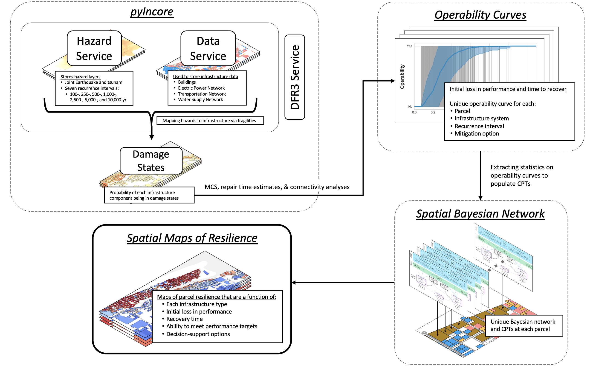

### 20200728_SBN

The notebooks contained in this directory are part of a spatial Bayesian network (SBN) that computes parcel-level resilience. **If one simply wants to run the SBN, then download the notebook in 3_SBN and associated CPT.h5 file at (...). Ensure that the jupyter notebook and the CPT.h5 file are in the same directory, then open up the notebook.** 

The entire process of performing the damage analysis, populating the CPT files and setting up the SBN is documented here. There are three primary sets of notebooks, organized into the following directories:

1. DamageCodes - uses pyIncore to estiamte damage state probabilities for infrastructure components. The damage state probabilities are used to inform Monte-Carlo simulation (MCS), repair time estimates, and (where applicable) connectivity analyses.  
2. CPTsH5 - used to extract results from the codes above and populate the SBN's conditional probability tables (CPTs). A single hdf5 file is generated for all parcels in Seaside. 
3. SBN - a notebook that uses the SBN as a decision support tool. The SBN relies on the CPTs produced from the previous code. A copy of the pre-populated CPT.h5 file can be access at (...). 

A conceptual view of the overall framework:

